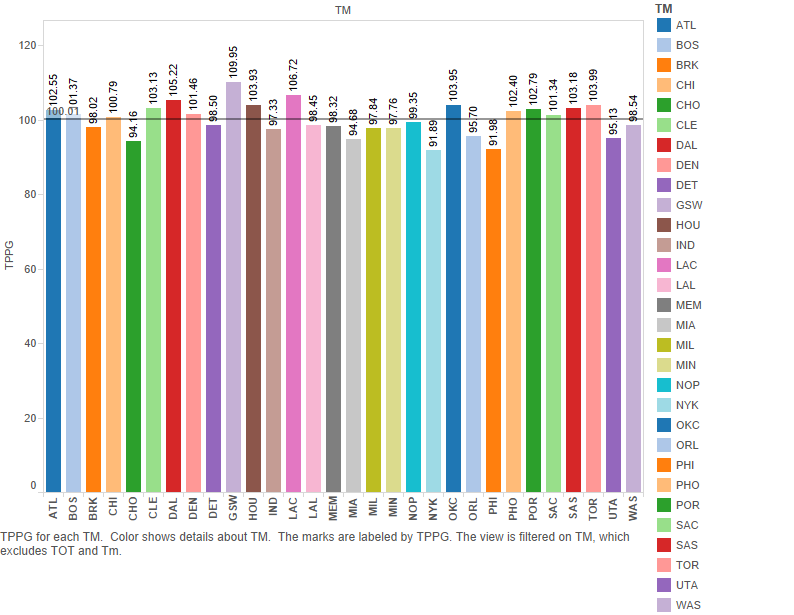
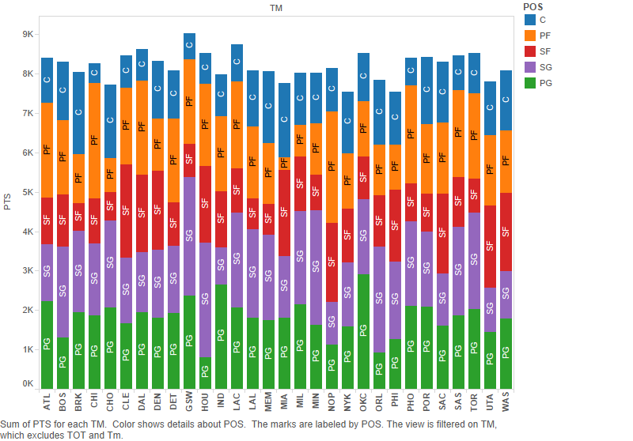
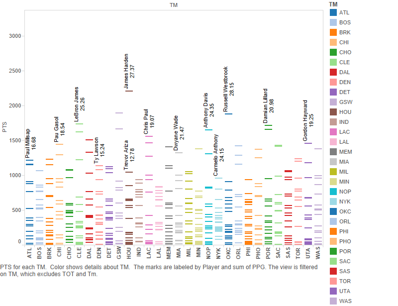
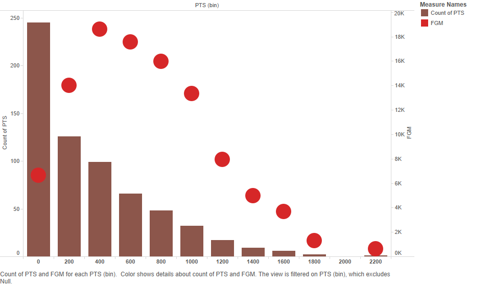
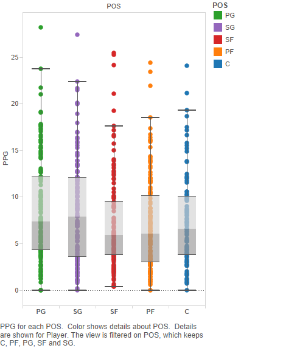
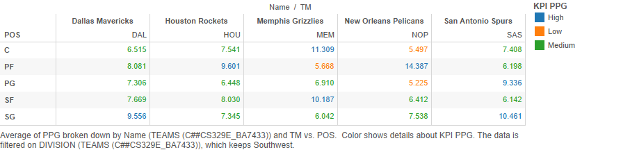
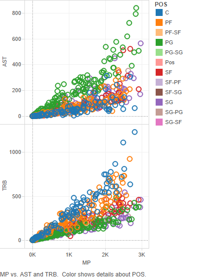
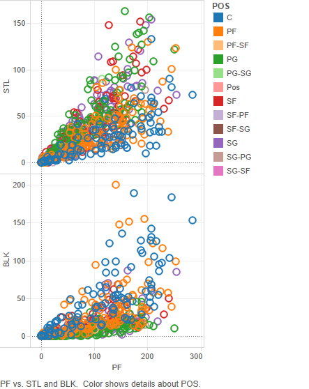
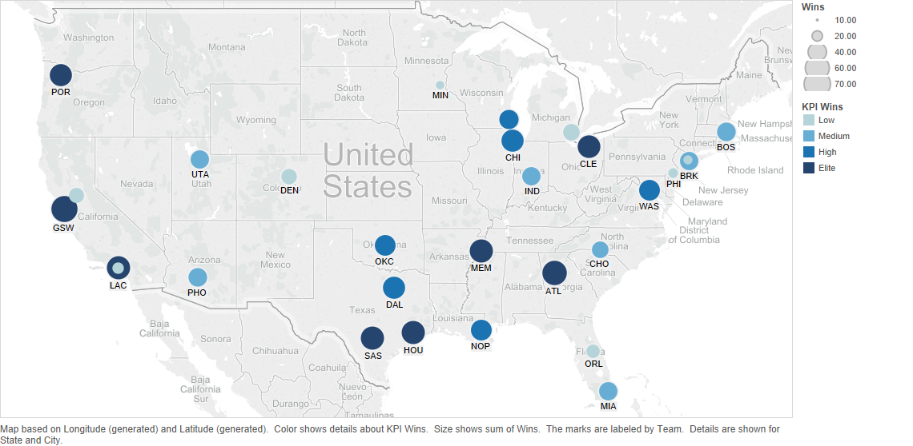

  Data Visualization Final Project: NBA Statistics for the 2014-2015 Season
===
**Bryan Amaefule, Shannon Lu, Kevin Lee**  
[Shiny Application](https://ba7433.shinyapps.io/DV_FinalProject)

**Points By Team**  
  
1. Drag TM (team) into the columns as a discrete variable.  
2. Create new parameter titled TPPG (Team Points Per Game) which is the sum of points by all the players divided by 82 and drag that into rows.  
3. Drag TM to color, and TPPG to label.  
4. Click on analytics tab and drag average line to table.  
5. Edit the average line and change label to value.

**Points By Position**  
  
1. Drag TM into the columns as a discrete variable.  
2. Drag PTS (points) to rows and aggregate measure as sum.  
3. Drag TM to filter and select all but "TOT".  
4. Drag POS (position) to color.  
5. Drag POS to label.  

**Points By Player**  
  
1. Drag TM into the columns as a discrete variable.  
2. Drag PTS to rows and change to dimension.  
3. Drag team to color.  
4. Create calculated field called PPG (PTS / G) and aggregate as sum.  
5. Drag Player to label and PPG to label.  

**Points Histogram**  
  

**Boxplot**  
   
1. Drag POS to columns.  
2. Drag PPG to rows.  
3. Drag POS to color.  
4. Drag Player to detail.  
5. Filter out intermediate positions.  

**Crosstab**  
  
1. Merge TEAMS dataset with GENERAL_STATS.  
2. Drag NAME from TEAMS and TM from GENERAL_STATS to columns.  
3. Drag POS to rows.  
4. Create parameters PPG Low and PPG Med.  
5. Create calculated field KPI PPG.  
6. Drag PPG to text and aggregate as average
7. Drag KPI PPG to color.

**Assists and Rebounds by Position**  
  
1. Drag AST (assists) and TRB (total rebounds) to rows.  
2. Drag MP (minutes played) to columns.  
3. Color by POS.  

**Steals and Blocks by Position**  
  
1. Drag STL (Steals) and BLK (Blocks) to rows.  
2. Drag PF (Personal Fouls) to columns.  
3. Color by POS.  

**Map**  
  
1. In TEAMS dataset, make sure city and state labelled under geographic role - State/Province.  
2. Double-click State to generate longitude and latitude.  
3. Drag Wins to size and aggregate as sum.   
4. Create parameters for wins.  
5. Create calculated field KPI Wins and drag onto color.  
6. Drag DIVISION onto pages.  
